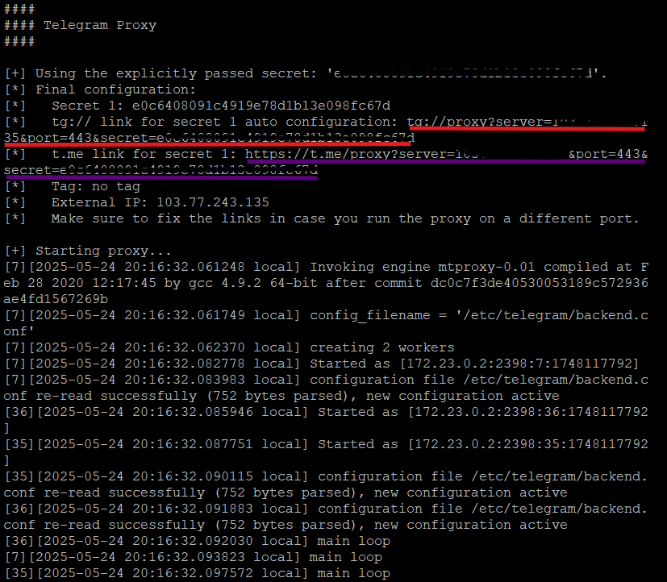

MTProto Proxy Là Gì?​
MTProto Proxy là một loại proxy được Telegram phát triển dựa trên giao thức bảo mật MTProto (Mobile Transport Protocol). Không giống các proxy HTTP hoặc SOCKS, MTProto Proxy chỉ dùng cho Telegram, giúp người dùng:
Truy cập Telegram khi bị nhà mạng chặn.
Ẩn danh khi sử dụng Telegram
Tránh bị kiểm duyệt hoặc giám sát bởi nhà cung cấp mạng.
MTProto Proxy thường hoạt động tốt hơn VPN trong việc bypass tường lửa mà không làm chậm tốc độ kết nối.
Hướng Dẫn Tạo Proxy MTProto Riêng Trên VPS​
Bước 1:
Chuẩn bị 1 vps chạy linux
Cài Docker: tham khảo tại đây
Cài Docker compose: tham khảo tại đây

Bước 2:
- Chạy lệnh này để tạo folder telegram-proxy và truy cập vào đó
Bash:
mkdir telegram-proxy && cd telegram-proxy

- Chạy lệnh này để tạo file docker-compose trong folder telegram-proxy
Bash:
sudo vim docker-compose.yml

copy và paste cái đống này vào

YAML:
services:
  mtproto-proxy:
    image: telegrammessenger/proxy:latest
    container_name: mtproto-proxy #<TÊN DOCKER>
    ports:
      - "443:443" # CỔNG MẶC ĐỊNH, CÓ THỂ ĐỔI SANG CỔNG KHÁC
    environment:
      - SECRET=<YOUR_SECRET_HERE> # THAY THẾ BẰNG SECRET CỦA BẠN
    restart: always

chạy lệnh này là thay kết quả vào vào <YOUR_SECRET_HERE>
Bash:
head -c 16 /dev/urandom | xxd -p

ở phần port mk dùng cổng 8443 thay vì cổng 443 như mặc định vì có chương trình khác dùng cổng 443 rồi nên sửa đoạn port trong file docker-compose.yml thành như sau #CÓ THỂ BỎ QUA BƯỚC NÀY
Bash:
    ports:
      - "8443:443"

Bước 2: chạy lệnh này để tải image Docker (nếu chưa có) và khởi chạy container proxy ở chế độ nền
Bash:
docker-compose up -d

Bước 3: chạy lệnh này để xem link kết nối của mtproto-proxy, nếu tên của Docker bạn đặt khác tại phần container_name: <TÊN DOCKER> thì chạy lệnh docker ps để xem tên docker và thay tên docker vào
Bash:
docker logs mtproto-proxy

kết quả thì ta có được 2 dạng đường link như sau
Bash:
tg://proxy?server=XXX.XX.XXX.XXX&port=443&secret=xxxxx

https://t.me/proxy?server=XXX.XX.XXX.XXX&port=443&secret=xxxxx

LƯU Ý:
Vì ở phần port mk dùng cổng 8443 thay vì cổng 443 như mặc định do có chương trình khác dùng cổng 443 rồi nên trong đường link sửa phần port thành kết quả như sau, và đây là kết quả cuối cùng, có thể dùng để gởi vào chat tele sau đó thì click vào link để kết nối.

Bash:
tg://proxy?server=XXX.XX.XXX.XXX&port=8443&secret=xxxxx

https://t.me/proxy?server=XXX.XX.XXX.XXX&port=8443&secret=xxxxx

Github: https://github.com/alexbers/mtprotoproxy

